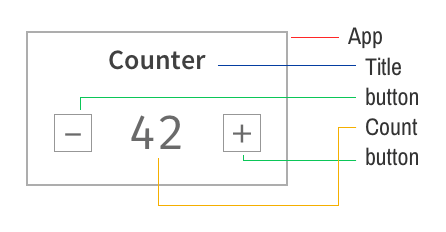
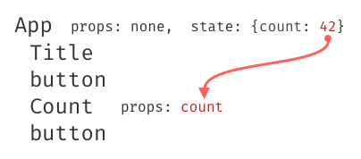
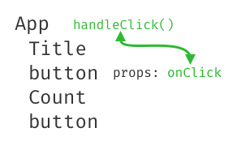
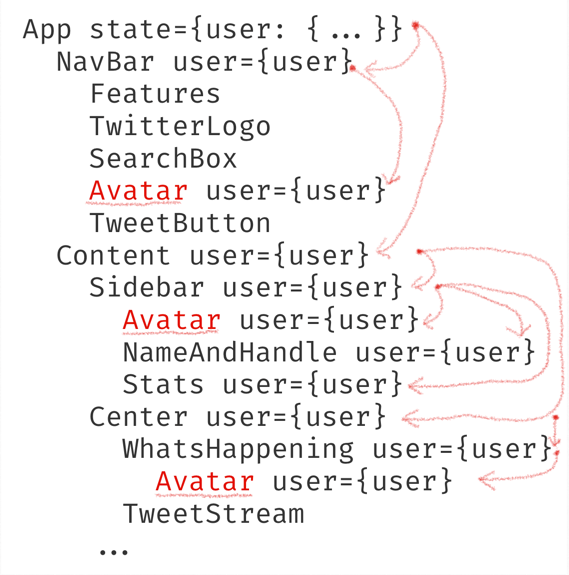
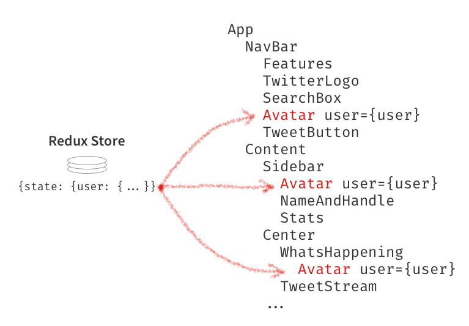

# Introduction to React Redux

[TOC]

## Problems facing React Apps

In a simple React App, data is passed down the component tree via `props`.

Given a counter component like this:



* The `count` variable stored in the `App`'s state will be **passed down as a prop**:



* To make data to come back up to the component tree, a callback function is needed in any components that want to call it to pass data up.



### Passing data multiple levels in the component tree

Top Level Container has data that nested Child Components need, passing down the info all the way down can be a pain.


Suppose the top-level container holds the `user` data object in the state, a bunch of intermediate components that don't need the data might also get wired in order to pass these props down to the `Avatar` components.



**Refactoring and reusing components can become quite difficult.**

### Passing data between ajacent components

* If the sibling components need to share data, the normal way is to **lift up these data to a parent component and pass it down as props**. It can become cumbersome in certain cases (UI theme, locale preferences).

* **The React Context API** is another alternative to pass down the data around without passing props at every level of the tree.

* **React Hooks** `useContext` and `useReducer` can also solve this problem.

* Use `children` prop.
* ==Use React-Redux to connect any data to any component.==

### Benefits using React-Redux

* Plug any component into Redux's store and read the data it needs.



* Improved DX (Developer Experience) with Redux DevTools.
* Writing code in a more maintainable fashion.

## Adding Redux to React App

1. Create a fresh React App

   ```shell
   $ npx create-react-app react-redux-demo
   ```

2. Adding the `Counter.js` component

   ```jsx
   // Counter.js
   import React from 'react';
   
   class Counter extends React.Component {
       state = { count: 0 };
   
       increment = () => {
           this.setState({
               count: this.state.count + 1
           });
       };
   
       decrement = () => {
           this.setState({
               count: this.state.count - 1
           });
       };
   
       render() {
           return (
               <div>
                   <h2>Counter</h2>
                   <div>
                       <button onClick={this.decrement}>-</button>
                       <span>{this.state.count}</span>
                       <button onClick={this.increment}>+</button>
                   </div>
               </div>
           );
       }
   }
   
   export default Counter;
   ```

3. Install `redux` and `react-redux` dependencies

   ```shell
   $ npm install --save redux react-redux
   ```

   * `redux`: provides a store for getting and setting the state, and respond when the state changes.
   * `react-redux`: a redux binding for React which lets you connect pieces of the state to React components.

4. Create the Redux Store

   * Redux has one global store

   * Technically, the state is the data, and the store is where it's kept.

   * Redux comes with a handy function called `createStore` to create store.

   * Now we are adding a store in `App.js`

     ```jsx
     // App.js
     import React from 'react';
     import { createStore } from 'redux';
     import Counter from './Counter';
     import './App.css';
     
     const store = createStore();
     
     function App() {
         return (
             <div className='App'>
                 <Counter />
             </div>
         );
     }
     
     export default App;
     ```

5. Add a reducer to the store

   * The store needs a Reducer.

   * The `createStore()` method need an argument called **reducer**. It is a function that will return the state. Similar to the `Array.prototype.reduce()` function, **redux reducers reduce a set of actions (over time) into a single state**.

     ```jsx
     // reduce function
     // @desc	it takes the current state and an action, and returns the // 				new State
     (state, action) => newState
     ```

   * Add the reducer function

     ```jsx
     // App.js
     function reducer(state, action) {
         console.log('reducer', state, action);
         return state;
     }
     
     const store = createStore(reducer);
     ```

6. Give the Reducer an Initial State

   * The reducer should return the **initial state** the first time it is called.

   * Conventionally, we define an `initialState` variable.

     ```jsx
     // App.js
     const initialState = {
         count: 0
     };
     
     function reducer(state = initialState, action) {
         console.log('reducer', state, action);
         return state;
     }
     ```

   * The state of your App has to be defined, so **never return undefined from a reducer**.

7. Change the state by dispatching actions.

   * An **action** in Redux is a plain JavaScript object with a property called `type`

   * It's a good practice to define `type` as string constants

   * An action object describes a change you want to make ("increase the counter") or an event that happened("request failed due to networ error")

   * In order to make an action to do something, we need to **dispatch** it.

   * **Redux Dispatch**: the redux store has a built-in `dispatch` function which can be called by providing an action. Redux will call your reducer function with that action and return the new state.

     ```jsx
     // App.js
     const store = createStore(reducer);
     
     store.dispatch({ type: 'INCREMENT' });
     store.dispatch({ type: 'DECREMENT' });
     store.dispatch({ type: 'RESET' });
     ```

8. Handle actions in the Redux Reducer

   * In order to make actions really do something, we need to change the logic in the reducer based on the `type` of action. A common way to do it is using `switch`

     ```jsx
     // App.js
     function reducer(state = initialState, action) {
         console.log('reducer', state, action);
         switch (action.type) {
             case 'INCREMENT':
                 return { count: state.count + 1 };
             case 'DECREMENT':
                 return { count: state.count - 1 };
     				case 'RESET':
                 return { count: 0 };
             default:
                 return state;
         }
     }
     
     ```

   * ==Note==: reducers must be **pure functions**, they cannot modify the arguments (the state argument) nor have side effects (outside the scope of the function).

## Use Redux with React

At this point, our React App has a `store` with a `reducer` that knows how to update the `state` when it receives an `action`.

To hook up Redux to React, we need to use `react-redux` library. The library comes with a component called `Provider`, and a function called `connect`.

1. Adding the `Provider` component

   * By wrapping the entire app with the `Provider` component, every component in the app tree can access the Redux store.

   * The `Provider` component  requires the `store` as its prop.

     ```jsx
     // App.js
     import { Provider } from 'react-redux';
     
     function App() {
         return (
             <Provider store={store}>
                 <div className='App'>
                     <Counter />
                 </div>
             </Provider>
         );
     }
     ```

   * `Provider` under the hood is using React's Context API to connect every component. In React-Redux we need to use the `connect` function on our components to access the store.

2. Preparing the Counter Component for Redux

   * Instead of using the `count` property in local state of Counter component, we will use the `count` as a prop from Redux.

     ```jsx
     // Counter.js
     import React from 'react';
     
     class Counter extends React.Component {
         // state = { count: 0 };    // remove count from local state
     
         increment = () => {
             // this.setState({  // remove this and update later
             //     count: this.state.count + 1
             // });
         };
     
         decrement = () => {
             // this.setState({  // remove this and update later
             //     count: this.state.count - 1
             // });
         };
     
         render() {
             return (
                 <div className='counter'>
                     <h2>Counter</h2>
                     <div>
                         <button onClick={this.decrement}>-</button>
                         <span className='count'>{this.props.count}</span>
                         <button onClick={this.increment}>+</button>
                     </div>
                 </div>
             );
         }
     }
     
     export default Counter;
     ```

   * Connect Counter Component to Redux

     ```jsx
     // Counter.js
     import { connect } from 'react-redux'; // 1. import the connect function
     
     // 2. Add the function
     function mapStateToProps(state) {
         return { count: state.count };
     }
     
     
     // export default Counter;
     
     export default connect(mapStateToProps)(Counter); // 3. export the connected Counter Component
     ```

   * A note on `connect`

     `connect` is a higher-order function, it hooks into Redux and **pulls out the entire state,** and pass it through the `mapStateToProps` function provided.

     The object returned from `mapStateToProps` get fed into the component as **props**. It is useful to sort out the state and give the right shape of the object to your component instead of letting it figuring out later.

3. Dispatch redux actions from a React Component

   * To dispatch the actions to change the count of the component, we also need to pass the `dispatch` function in `connect` function.

   * Inside the Counter Component, we call `this.props.dispatch` with an action.

     ```jsx
     // Counter.js
     		increment = () => {
             // this.setState({  // remove this and update later
             //     count: this.state.count + 1
             // });
             this.props.dispatch({ type: 'INCREMENT' });
         };
     
         decrement = () => {
             // this.setState({  // remove this and update later
             //     count: this.state.count - 1
             // });
             this.props.dispatch({ type: 'DECREMENT' });
         };
     ```

4. Convert plain strings into **action constants**.

   * Action constants help avoid typos.

   * To write an action constant, you only need to store the strings in variables.

   * We can put these constants in an `action.js` file.

     ```jsx
     // actions.js
     export const INCREMENT = 'INCREMENT';
     export const DECREMENT = 'DECREMENT';
     export const RESET = 'RESET';
     ```

     ```jsx
     // Counter.js
     import { INCREMENT, DECREMENT } from './actions';
     
     class Counter extends React.Component {
     		// ...
     
         increment = () => {
             this.props.dispatch({ type: INCREMENT });
         };
     
         decrement = () => {
             this.props.dispatch({ type: DECREMENT });
         };
     
     		// ...
     }
     ```

5. Use Redux Action Creator (optional)

   As the app grows larger, actions start to get more complex, this is where action creators come in.

   An **action creator** in Redux is a function that returns an action object.

   ```jsx
   // actions.js
   
   // Action Creators
   export const increment = () => ({ type: INCREMENT });
   export const decrement = () => ({ type: DECREMENT });
   ```

   ```jsx
   // Counter.js
   import { increment, decrement } from './actions';
   
   class Counter extends React.Component {
     	// ...
       increment = () => {
           this.props.dispatch(increment()); // need to call the action creator function
       };
   
       decrement = () => {
           this.props.dispatch(decrement());
       };
   		// ...
   }
   ```

   > Note: the dispatch wants an action object, not a function. We need to call the action creator function inside the dispatch.

6. Use React Redux mapDispatchToProps

   Instead of typing `this.props.dispatch` all the time, we can start writing a `mapDispatchToProps` object and pass it to `connect` when wrapping the component.

   Then we can receive those action creators as function props.

   ```jsx
   // Counter.js
   
   class Counter extends React.Component {
     	// ...
       increment = () => {
           this.props.increment();
       };
   
       decrement = () => {
           this.props.decrement();
       };
   		// ...
   }
   
   // in this object, keys become prop names,
   // and values should be action creator functions.
   // They get bound to `dispatch`. 
   const mapDispatchToProps = {
       increment,
       decrement
     };
   
   export default connect(mapStateToProps, mapDispatchToProps)(Counter);
   ```

### Fetch Data with Redux Thunk

> Reducers are pure functions and we cannot do API calls or dispatch actions from inside a reducer.
>
> We cannot do API cal inside a plain action creator.

#### Introduce redux thunk

One possible way to do this is to make an action creator **return a function that does the API call**.

```jsx
function getData() {
  return function() {
    return fetch('url');
  }
}
```

This is where `redux-thunk` middleware comes in, it is a plugin for redux to enable it deal with such actions. So we can dispatch these thunk actions `dispatch(getData())`

A "**thunk**" is a name for a function that's returned by another function.

```jsx
// an action creator that returns a function
function doStuff () {
  return function (dispatch, getState) {
    // dispatch actions here
    // or fetch data
    // etc.
  }
}
```

The function returned accepts two arguments: the `dispatch` function, and the `getState` function (optional) in case you want to do something conditionally.

#### Setup redux thunk

```shell
$ npm install --save redux-thunk
```

```jsx
// App.js
import thunk from 'redux-thunk';
import { createStore, applyMiddleware } from 'redux';

const store = createStore(reducer, applyMiddleware(thunk));
```

#### A practical example

We have a API returns a list of products. 

1. We create a thunk action in `productActions.js` to do the fetching.

   * Redux actions that fetch data usually come in triplets: BEGIN, SUCCESS, FAILURE. This pattern gives you hooks to keep track of what's happening.

   * Before the API call, you dispatch the BEGIN action; After the call succeeds, you dispatch SUCCESS action with data. If it fails, you dispatch FAILURE with error.

     ```jsx
     // productActions.js
     // ACTION TYPES
     export const FETCH_PRODUCTS_BEGIN = 'FETCH_PRODUCTS_BEGIN';
     export const FETCH_PRODUCTS_SUCCESS = 'FETCH_PRODUCTS_SUCCESS';
     export const FETCH_PRODUCTS_FAILURE = 'FETCH_PRODUCTS_FAILURE';
     
     // ACTIONS
     export const fetchProductsBegin = () => ({
         type: FETCH_PRODUCTS_BEGIN
     });
     
     export const fetchProductsSuccess = products => ({
         type: FETCH_PRODUCTS_SUCCESS,
         paload: { products }
     });
     
     export const fetchProductsFailure = error => ({
         type: fetchProductsFailure,
         payload: { error }
     });
     ```

2. We write a reducer to save the products into Redux store when it receives the `FETCH_PRODUCTS_SUCCESS` action. We also set a loading flag based on the fetch begins or fails.

   ```jsx
   // productReducer.js
   import {
       FETCH_PRODUCTS_BEGIN,
       FETCH_PRODUCTS_SUCCESS,
       FETCH_PRODUCTS_FAILURE
   } from './productActions';
   
   const initialState = {
       items: [],
       loading: false,
       error: null
   };
   
   export default function productReducer(state = initialState, action) {
       switch (action.type) {
           case FETCH_PRODUCTS_BEGIN:
               return {
                   ...state,
                   loading: true,
                   error: null
               };
           case FETCH_PRODUCTS_SUCCESS:
               return {
                   ...state,
                   loading: false,
                   items: action.payload.products
               };
           case FETCH_PRODUCTS_FAILURE:
               return {
                   ...state,
                   loading: false,
                   error: action.payload.error,
                   items: []
               };
           default:
               return state;
       }
   }
   ```

3. We have the `ProductList` component that will call the API and display the data.

   ```jsx
   // ProductList.js
   import React from 'react';
   import { connect } from 'react-redux';
   import { fetchProducts } from './productActions';
   
   class ProductList extends React.Component {
       componentDidMount() {
           this.props.fetchProducts();
       }
   
       render() {
           const { error, loading, products } = this.props;
   
           if (error) {
               return <div>Error! {error.message}</div>;
           }
   
           if (loading) {
               return <div>Loading...</div>;
           }
   
           return (
               <ul>
                   {products.map(product => (
                       <li key={product.id}>{product.name}</li>
                   ))}
               </ul>
           );
       }
   }
   
   // we may have more than one reducer and 
   // each reducer should have its own slice of state
   const mapStateToProps = state => ({
       products: state.products.items,
       loading: state.products.loading,
       error: state.products.error
   });
   
   const mapDispatchToProps = {
       fetchProducts
   };
   
   export default connect(
       mapStateToProps,
       mapDispatchToProps
   )(ProductList);
   ```

4. Add a `rootReducer.js` to pull all state together.

   ```jsx
   // rootReducer.js
   import { combineReducers } from 'redux';
   import { products } from './productReducer';
   
   export default combineReducers({
       products
   });
   ```

   update the store using rootReducer.

   ```jsx
   // App.js
   import rootReducer from './rootReducer';
   import ProductList from './ProductList';
   
   const rootStore = createStore(rootReducer, applyMiddleware(thunk));
   
   function App() {
       return (
           <Provider store={rootStore}>
               <div className='App'>
                   <ProductList />
               </div>
           </Provider>
       );
   }
   ```

## Recap

* `Redux` is used to manage data in a React application. Using redux means you create a **store** that a React app listens to.

* How to create a `store` and read data from it.

  ```jsx
  import { createStore } from 'redux'
  
  const reducer = ...
  const store = createStore(reducer, { initialState });
  
  const state = store.getState();
  ```

* You can't change the store's state from outside the store. You need to dispatch **actions**. It gets dispatched to the reducer.

  ```jsx
  store.dispatch({ type: 'INCREMENT'})
  ```

* **Reducers** tell us how to change a state based on an action. They are pure functions which never mutates objects.

  ```jsx
  function reducer (state, action) {
    if (action.type === 'INCREMENT') {
      return { ...state, count: state.count + 1 }
    }
    return state;
  }
  ```

* You can use `combineReducers()` to break a big reducer into smaller reducers.

  ```jsx
  const profile = (state, action) => ( { /*...*/ } )
  const avatar = (state, action) => ( { /*...*/ } )
  
  export default combineReducers({ profile, avatar })
  ```

* The store keeps the **state**, you can listen for updates using subscribe.

* **Action creators** are functions that return things you can pass to `dispatch()`

  ```jsx
  export function getUser (userId) {
    return { type: 'GET_USER', id: userId }
  }
  ```

* `redux-thunk` is a plugin that will allow you to pass functions to `dispatch()`. It is useful for handling asynchronous actions.

  ```jsx
  export const getUser = id => dispatch => {
    dispatch({ type: 'GET_USER_BEGIN', userId: id });
    return fetch(`/users/${id}`)
    	.then(data => dispatch({ type: 'GET_USER_SUCCESS', data }))
    	.catch(err => dispatch({ type: 'GET_USER_FAILURE', err }))
  }
  ```

* Middleware are plugins for Redux that extends `dispatch()` to do more things.

  ```
  store = createStore(reducer, applyMiddleware(thunk));
  ```

* `react-redux` lets you make Redux and React work together. 

* **Provider** makes react components aware of a store.

  ```jsx
  import { Provider } from 'react-redux';
  
  function App () {
    return (
      <Provider store={store}>
        <AppContent />
      </Provider>
  }
  ```

* `connect()` lets components communicate with a store.

  ```jsx
  import { connect } from 'react-redux'
  
  export default connect(mapStateToProps, mapDispatchToProps)(WrappedComponent)
  ```

* `mapStateToProps` return props taken from the state tree.

  ```jsx
  const mapStateToProps = state => ({
    userData: state.profile.userData,
    avatar: state.avatar,
  })
  ```

* `mapDispatchToProps` return props that are functions to dispatch actions.

  ```jsx
  const mapDispatchToProps = dispatch => ({
  	updateCurrent: () => dispatch(updateCurrentUser())
  })
  ```

  

## Appendices

Redux Data Flow Diagram http://slides.com/jenyaterpil/redux-from-twitter-hype-to-production#/9


Redux Side Effects Data Flow http://slides.com/jenyaterpil/redux-from-twitter-hype-to-production#/23

